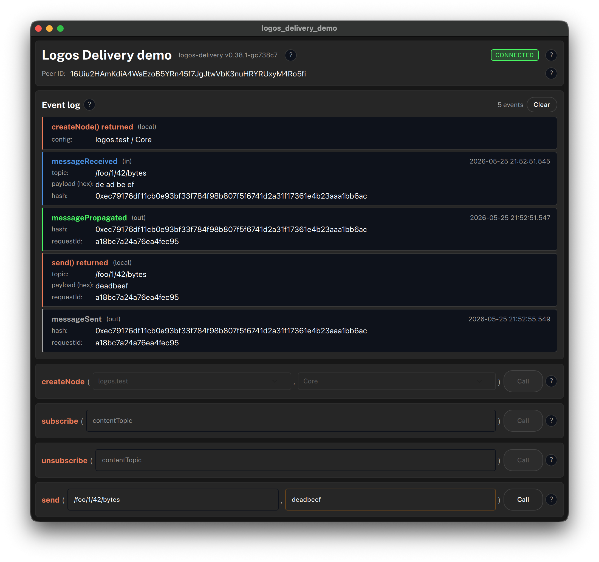

# logos-delivery-demo

A small `ui_qml` module that demonstrates **how an application uses [`logos-delivery-module`](https://github.com/logos-co/logos-delivery-module)** to send and receive messages on the Logos messaging network.

This repo is the runnable companion to the journey doc [**Use the Logos Delivery module API from an app**](https://github.com/logos-co/logos-docs/blob/main/docs/messaging/journeys/use-the-logos-delivery-module-api-from-an-app.md) — every code path in the doc is exercised here, and every interactive control has an info button explaining which `delivery_module` API call it triggers.

Pinned to `logos-delivery-module` [**`v0.1.3`**](https://github.com/logos-co/logos-delivery-module/tree/v0.1.3).



## What it shows

- Declaring `delivery_module` as a Logos module dependency (in `metadata.json` and `flake.nix`)
- Constructing the typed `LogosModules` wrapper from `LogosAPI*` in `initLogos`
- Bootstrapping the node from the UI with `createNode(...)` and `start()`, with `LogosResult` checks — the fleet (`logos.test` / `logos.dev`, defaulting to `logos.test`) and node mode (`Core` / `Edge`) are picked from dropdowns
- Polling `delivery_module.getNodeInfo("MyPeerId")` for my peer ID every 3s, and reading the `logos-delivery` library version once at startup (`getNodeInfo("Version")`)
- Surfacing `connectionStateChanged` as a live status badge
- A **global event log** that renders every observed event verbatim — `messageReceived`, `messageSent`, `messagePropagated`, `messageError`, plus the local return values of `createNode()` / `subscribe()` / `unsubscribe()` / `send()` — colour-coded by event kind, with every field selectable so you can copy hashes, topics, payloads, request ids
- A **method-call playground** at the bottom: one row per public `delivery_module` API call (`createNode`, `subscribe`, `unsubscribe`, `send`), rendered as `methodName(arg…)` with a `Call` button — every interaction is reflected as a row in the event log above. `createNode`'s two arguments are fixed-choice enums picked from dropdowns; message payloads are raw **bytes**: enter them as hex when sending, and received payloads are shown as hex
- An info `?` chip next to every interactive element with a tooltip spelling out the exact `delivery_module` call behind it — the demo doubles as live API documentation
- Using **[`Logos.Theme`](https://github.com/logos-co/logos-design-system) and `Logos.Controls`** for tokens, colors, and themed components — no hard-coded styling in the demo

## Build & run

Prerequisites: Nix with flakes enabled. macOS (aarch64/x86_64) or Linux (aarch64/x86_64).

```bash
# Build the module
nix build

# Preview the UI standalone (uses logos-standalone-app, bundled with logos-module-builder)
nix run

# Package as an installable .lgx
nix build .#lgx
# → ./result/logos-logos_delivery_demo-module.lgx
```

Install the `.lgx` into a Logos host (e.g. `logos-basecamp` or `logoscore`):

```bash
lgpm install ./result/logos-logos_delivery_demo-module.lgx --to ./modules
```

## Repository layout

```
logos-delivery-demo/
├── flake.nix                            # pins delivery_module to v0.1.3
├── metadata.json                        # type: ui_qml, deps: [delivery_module]
├── CMakeLists.txt
└── src/
    ├── logos_delivery_demo.rep          # Qt Remote Objects contract
    ├── logos_delivery_demo_interface.h  # plugin interface (discovery)
    ├── logos_delivery_demo_plugin.h     # C++ backend
    ├── logos_delivery_demo_plugin.cpp   # wires delivery_module events → QML, exposes slots
    └── qml/
        └── Main.qml                     # the UI
```

The C++ backend lives in the `ui-host` process; the QML view runs in the host application. They communicate over Qt Remote Objects (auto-generated from `logos_delivery_demo.rep`).

## Network

The node is **not** started automatically. Use the `createNode` row in the method-call playground to create and start it against a chosen network: pick the preset — **`logos.test`** (Logos Test Network, the default) or **`logos.dev`** (Logos Dev Network) — and the node **mode** — `Core` (full relay node) or `Edge` (light node). `createNode` can be called once per session; the other API calls stay disabled until the node is ready. To switch fleet/mode, restart the app.

### Running multiple instances on one machine

Run `nix run` twice in separate terminals — subscribe both to the same content topic, send from one, and the other will fire `messageReceived`. The demo specifies no ports, so `logos-delivery-module` defaults them to `0` and the OS assigns free ports per instance — the underlying waku listeners (TCP, discv5, …) don't collide.

## References

- [Journey doc — Use the Logos Delivery module API from an app](https://github.com/logos-co/logos-docs/blob/main/docs/messaging/journeys/use-the-logos-delivery-module-api-from-an-app.md)
- [`logos-delivery-module` @ v0.1.3](https://github.com/logos-co/logos-delivery-module/tree/v0.1.3)
- [`logos-module-builder` — the Nix flake library this demo builds with](https://github.com/logos-co/logos-module-builder)
- [Logos module developer guide](https://github.com/logos-co/logos-tutorial/blob/master/logos-developer-guide.md) — full walkthrough of module dev, `LogosResult`, generated wrappers
- [LIP-23 — content topic format](https://lip.logos.co/messaging/informational/23/topics.html)

## License

Dual-licensed under MIT and Apache 2.0, matching the rest of the Logos module ecosystem.
